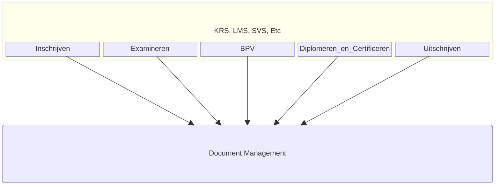
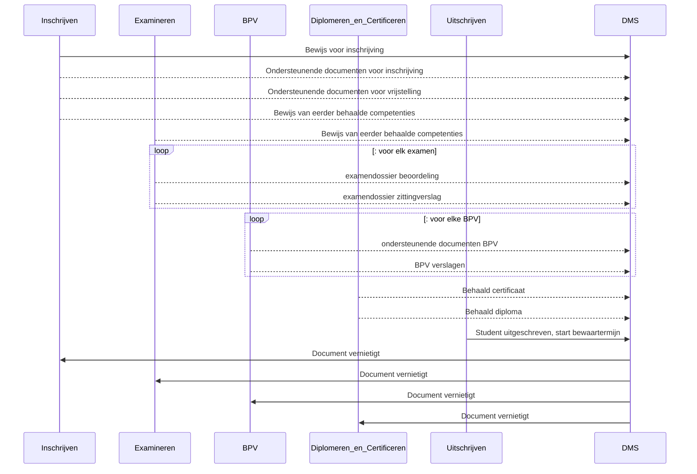

# OKD-Document-Management
Onderwijs Koppeling voor Document Management

```
NOTE: Onderstaande informatie is niet definitief. Er kunnen geen rechten aan ontleend worden.
```
Deze API definitie is in het kader van de OKx koppelingen in het MBO onderwijs in nederland. Het is een uitwerking van de door Npuls voorgestelde "OKx Best practise" om voor het MBO standaard koppelvlakkken te maken op basis van de OOAPI.

Deze koppeling definieerd de interactie tussen de diverse systeemen/modules op het gebied van document management. Dzez word momenteel ontworpen door scholene en leveranciers in het MBO.


https://mora.mbodigitaal.nl/index.php/Id-31e23eae-6bea-63fd-b4e9-79bc4f4981ae


Voor het vullen van de dossiers in het DMS voor een leerling zijn verschillende applicaties en componenten betrokken

- vanuit de module **"Inschrijven"** (KRS): 
  - ondersteunende documenten voor de inschrijving van de student
  - bewijs van eerder behaalde competenties en vrijstellingen vrijstellingen
- vanuit **"Examineren"** (SVS,KRS,OKE,VOLG):
  - bewijslast van behaalde examens (beoordelings docmuenten, soms gemaakt werk)
  - zittingsverslagen van bijgewoonde examens
- vanuit **"BPV"** module
  - Matchen en plaatsen: BPV overeenkomst en andere documenten
  - Begeleiden: Stage verslagen
- vanuit module **"Diplomeren en Certificeren"**: (KRS): 
  - behaalde certificaten
  - behaalde diploma's
- vanuit de module **"Uitschrijven"** (KRS): 
  - signaal dat student uitgeschreven is voor een studie en de bewaartermijn van alle documenten start

Vanuit het DMS worden signalen gegeven als de documenten werkelijk vernietigd zijn.
  - signaal dat document vernietigd is en niet meer in het DMS opgevraagd kan worden.


### Betrokken Applicaties en Mora componenten


### Flow gedurende de inschrijving van de student



natuurlijk kan een student meerdere inschrijvingen doorlopen

De flows worden in detail verder uitgewerkt, beschreven in de OOAPI structuur.
- [flow-1: Inschrijvings dossier](./doc/flow-1.md)
- flow-2: Examen dossier
- flow-3: BPV dossier
- flow-4: Diplomeren en Certificeren dossier
- flow-5: Uitschrijven
- flow-6: document vernietigt notificatie
- flow-x: Opvragen document (vanuit alle componenten naar DMS)


Nog te onderzoeken: zijn er flows vanuit het DMS naar deze modules voor het aanbieden van nieuwe documenten ?
