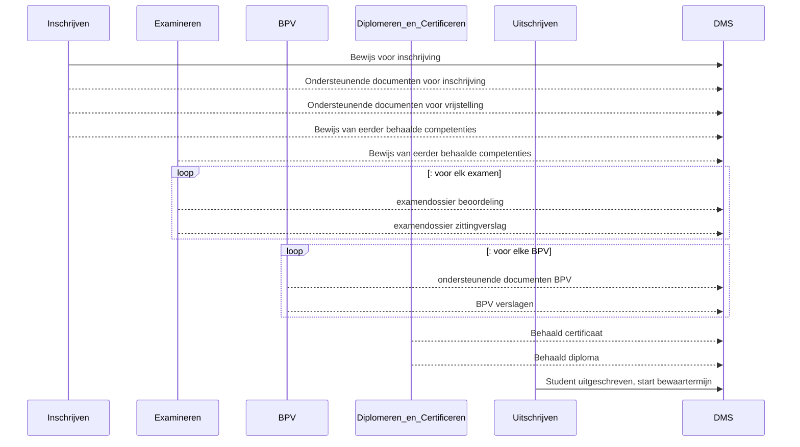

# OKD-Document-Management
Onderwijs Koppeling voor Document Management

```
NOTE: Onderstaande informatie is niet definitief. Er kunnen geen rechten aan ontleend worden.
```
Voor het vullen van de dossiers in het DMS voor een leerling zijn verschillende applicaties en componenten betrokken

- vanuit de module **"inschrijving"** (KRS): 
  - ondersteunende documenten voor de inschrijving van de student
  - bewijs van eerder behaalde competenties en vrijstellingen vrijstellingen
- vanuit **"Examinerings"** (SVS,KRS,OKE,VOLG):
  -  bewijslast van behaalde examens (beoordelings docmuenten, soms gemaakt werk)
  - zittingsverslagen van bijgewoonde examens
- vanuit **"BPV"** module
  - Matchen en plaatsen: BPV overeenkomst en andere documenten
  - Begeleiden: Stage verslagen
- vanuit module **"Diplomeren en Certificeren"**: (KRS): 
  - behaalde certificaten
  - behaalde diploma's
- vanuit de module **"uitschrijving"** (KRS): 
  - signaal dat student uitgeschreven is voor een studie en de bewaartermijn van alle documenten start


### Betrokken Applicaties en Mora componenten


### Flow gedurende de inschrijving van de student



natuurlijk kan een student meerdere inschrijvingen doorlopen

De flows worden in detail verder uitgewerkt, beschreven in de OOAPI structuur.
- [flow-1: Inschrijvings dossier](./doc/flow-1.md)
- flow-2: Examen dossier
- flow-3: BPV dossier
- flow-4: Examinering dossier
- flow-5: Uitschrijven

Nog te onderzoeken: zijn er flows vanuit dhet DMS naar deze modules ?
