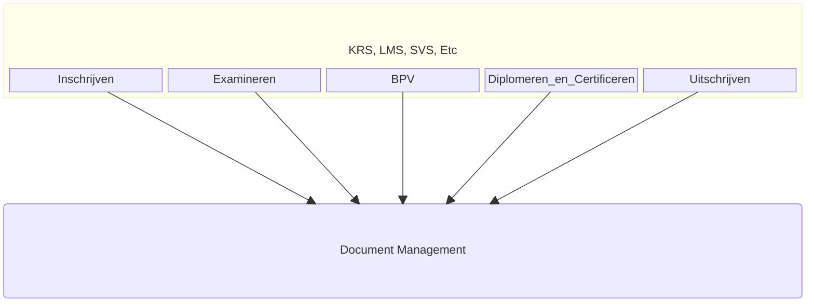
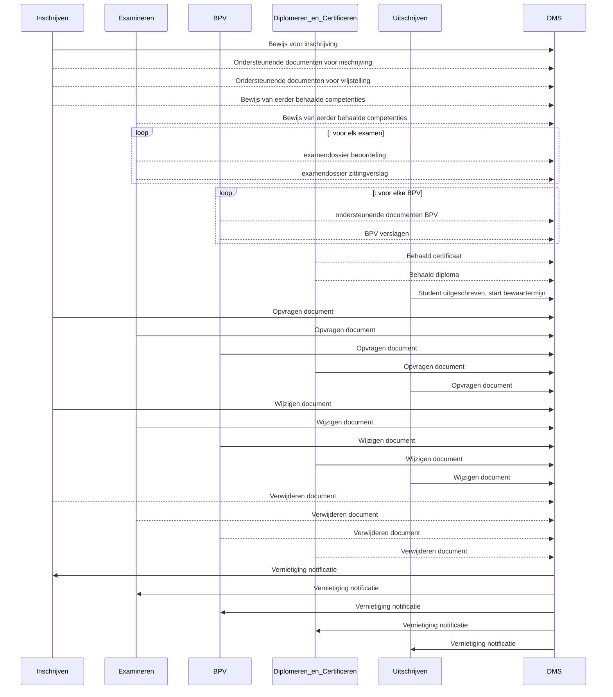

# OOAPI-OKD - Onderwijs Koppeling voor Document Management

```
NOTE: Onderstaande informatie is niet definitief. Er kunnen geen rechten aan ontleend worden.
```
## Doel van de koppeling
Steeds meer onderwijsinstellingen kiezen ervoor om gebruik te maken van en centraal DMS voor het registreren en preserveren van studenten- en examendossiers. Omdat er een breed scala aan applicaties aangesloten moeten worden, is er behoefte aan een gestandaardiseerde gegevensuitwisseling. Het doel van de OKD-koppeling is om documenten vanuit diverse applicaties en componenten over te brengen naar een DMS (Document Management Systeem). Tijdens deze overdracht wordt voldoende meta-informatie aan de documenten toegevoegd, zodat het DMS in staat is de documenten correct te categoriseren en de juiste bewaartermijnen toe te passen.

Verder biedt de koppeling de mogelijkheid om de overgedragen documenten opnieuw te bekijken. Het bijwerken van documenten en het signaleren wanneer documenten niet langer relevant zijn, maakt eveneens deel uit van de functionaliteiten.

Documenten kunnen vanuit verschillende applicaties worden aangeleverd, zodat het DMS een compleet overzicht heeft van alle relevante documenten van een student.


### Relatie met OKx

Deze API-definitie is opgesteld in het kader van de OKx-koppelingen binnen het MBO-onderwijs in Nederland. Het volgt de door Npuls voorgestelde "OKx Best practice" en richt zich op het creëren van standaard koppelvlakken voor het MBO, gebaseerd op de OOAPI.

Deze koppeling specificeert de interactie tussen verschillende systemen/modules op het gebied van documentbeheer. Momenteel wordt deze ontworpen door zowel scholen als leveranciers in het MBO.

### Relatie met MORA
#### Betrokken Applicatiecomponenten
https://mora.mbodigitaal.nl/index.php/Id-31e23eae-6bea-63fd-b4e9-79bc4f4981ae


#### Betrokken Applicaties en Componenten
Voor het vullen van de dossiers in het DMS voor een leerling zijn verschillende applicaties en componenten betrokken

- vanuit de module **"Inschrijven"** (KRS): 
  - ondersteunende documenten voor de inschrijving van de student
  - bewijs van eerder behaalde competenties en vrijstellingen
- vanuit **"Examineren"** (SVS,KRS,OKE,VOLG):
  - bewijslast van behaalde examens (beoordelingsdocumenten, soms gemaakt werk)
  - zittingsverslagen van bijgewoonde examens
- vanuit **"BPV"** module
  - Matchen en plaatsen: BPV overeenkomst en andere documenten
  - Begeleiden: Stage verslagen
- vanuit module **"Diplomeren en Certificeren"**: (KRS): 
  - behaalde certificaten
  - behaalde diploma's
- vanuit de module **"Uitschrijven"** (KRS): 
  - signaal dat student uitgeschreven is voor een studie en de bewaartermijn van alle documenten start

Vanuit het DMS worden signalen gegeven als de documenten werkelijk vernietigd zijn.
  - signaal dat document vernietigd is en niet meer in het DMS opgevraagd kan worden.




### Flows gedurende onderwijsperiode van de student


Natuurlijk kan een student meerdere inschrijvingen doorlopen

De flows worden in detail verder uitgewerkt, beschreven in de OOAPI structuur.
- flow-1: [Inschrijvings dossier](./doc/flow-1.md)
- flow-2: [Examen dossier](./doc/flow-2.md)
- flow-3: [BPV dossier](./doc/flow-2.md)
- flow-4: [Diplomeren en Certificeren dossier](./doc/flow-4.md)
- flow-5: [Uitschrijven](./doc/flow-5.md)
- flow-6: [document vernietigd notificatie](./doc/flow-6.md)
- flow-x: [Opvragen document (vanuit alle componenten naar DMS)](./doc/flow-x.md)
- flow-y: [Wijzigen document (vanuit alle componenten naar DMS)](./doc/flow-y.md)
- flow-z: [Verwijderen document (vanuit alle componenten naar DMS)](./doc/flow-z.md)

Authenticatie volgt de OKx aanbeveling en nl-gov en edustandaard richtlijnen. zie [authenticatie](./doc/authenticatie.md)


*Nog te onderzoeken*: zijn er flows vanuit het DMS naar deze modules voor het aanbieden van nieuwe documenten ? Dit is geen onderdeel van de OKD 1.0, maar wel voor volgende versie

## Version history

| Version | Date | Status | Author | Comment |
|---|---|---|---|---|
| 0.1 | jan 2025 | DRAFT | [@mcginkel](https://github.com/mcginkel) | |
| 0.2 | mei 2025 | DRAFT | [@mcginkel](https://github.com/mcginkel) and many others | flow 1,2,3,4 defined |
| 0.3 |  24 jun 2025 | DRAFT | Roel janssen and many others | flow x,y,z defined |
| 0.4 |  26 jul 2025 | DRAFT | [@mcginkel](https://github.com/mcginkel)  | Added OOAPI v5 spec |
| 0.5 |  29 jul 2025 | DRAFT | Tim Meijs  | flow z defined |
| 0.6 | 7 aug 2025 | DRAFT | [@mcginkel](https://github.com/mcginkel)  | flow 1 details, flow 5 en 6 en authenticatie |


This repository is an initiative of the MBO Digitaal and NPuls en leveranciers

## Contributors

Deze OKD standaard is gedefinieerd door een combinatie van leveranciers, scholen en MBO digitaal.

| Name | Organization | contact |
|---|---|---|
| Kees van Ginkel | Topicus (EduArte)  | [@mcginkel](https://github.com/mcginkel) -  kees@vanginkels.com |
| Theo vlastuin | Topicus (EduArte)  | |
| Roel Janssen | Visma Circle (Djuma)  | [@roeljanssen82](https://github.com/roeljanssen82) - roel.janssen@visma.com |
| Tim Meijs | Visma Circle (Djuma)  | [@TimVisma](https://github.com/timvisma) - tim.meijs@visma.com |
| Bas Retera | Visma Circle (Djuma)  | [@basretera](https://github.com/basretera) - bas.retera@visma.com |
