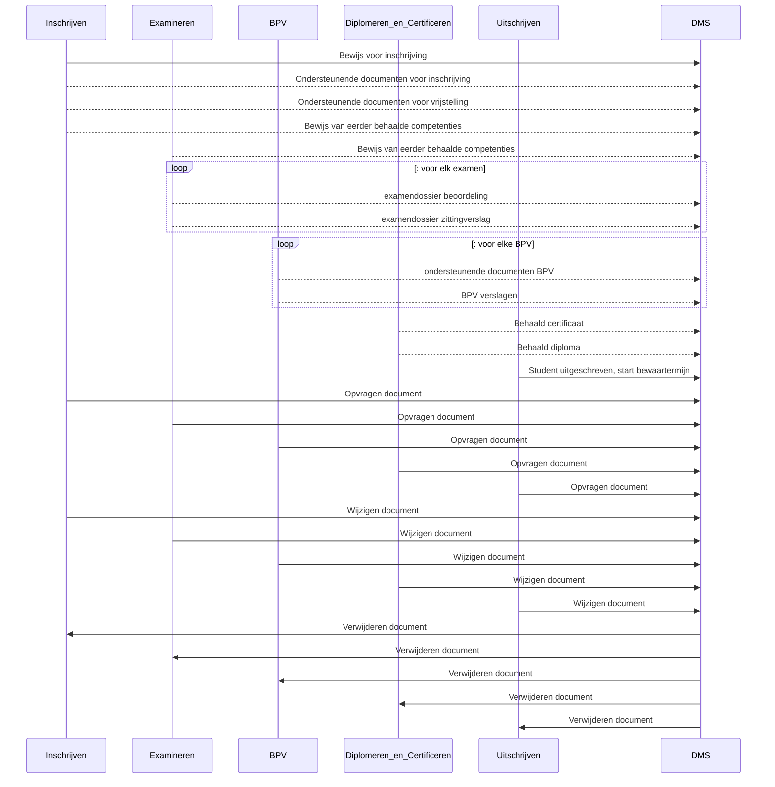

# OKD-Document-Management
Onderwijs Koppeling voor Document Management

```
NOTE: Onderstaande informatie is niet definitief. Er kunnen geen rechten aan ontleend worden.
```

#Inleidende tekst toevoegen (actie Roel)
todo

Deze API definitie is in het kader van de OKx koppelingen in het MBO onderwijs in Nederland. Het is een uitwerking van de door Npuls voorgestelde "OKx Best practice" om voor het MBO standaard koppelvlakken te maken op basis van de OOAPI.

Deze koppeling definieert de interactie tussen de diverse systemen/modules op het gebied van document management. Deze wordt momenteel ontworpen door scholen en leveranciers in het MBO.


https://mora.mbodigitaal.nl/index.php/Id-31e23eae-6bea-63fd-b4e9-79bc4f4981ae


Voor het vullen van de dossiers in het DMS voor een leerling zijn verschillende applicaties en componenten betrokken

- vanuit de module **"Inschrijven"** (KRS): 
  - ondersteunende documenten voor de inschrijving van de student
  - bewijs van eerder behaalde competenties en vrijstellingen
- vanuit **"Examineren"** (SVS,KRS,OKE,VOLG):
  - bewijslast van behaalde examens (beoordelingsdocumenten, soms gemaakt werk)
  - zittingsverslagen van bijgewoonde examens
- vanuit **"BPV"** module
  - Matchen en plaatsen: BPV overeenkomst en andere documenten
  - Begeleiden: Stage verslagen
- vanuit module **"Diplomeren en Certificeren"**: (KRS): 
  - behaalde certificaten
  - behaalde diploma's
- vanuit de module **"Uitschrijven"** (KRS): 
  - signaal dat student uitgeschreven is voor een studie en de bewaartermijn van alle documenten start

Vanuit het DMS worden signalen gegeven als de documenten werkelijk vernietigd zijn.
  - signaal dat document vernietigd is en niet meer in het DMS opgevraagd kan worden.


### Betrokken Applicaties en Mora componenten


### Flows gedurende onderwijsperiode van de student



Natuurlijk kan een student meerdere inschrijvingen doorlopen

De flows worden in detail verder uitgewerkt, beschreven in de OOAPI structuur.
- flow-1: [Inschrijvings dossier](./doc/flow-1.md)
- flow-2: [Examen dossier](./doc/flow-2.md)
- flow-3: [BPV dossier](./doc/flow-2.md)
- flow-4: [Diplomeren en Certificeren dossier](./doc/flow-4.md)
- flow-5: [Uitschrijven](./doc/flow-5.md)
- flow-6: [document vernietigd notificatie](./doc/flow-6.md)
- flow-x: [Opvragen document (vanuit alle componenten naar DMS)](./doc/flow-x.md)
- flow-y: [Wijzigen document (vanuit alle componenten naar DMS)](./doc/flow-y.md)
- flow-z: [Verwijderen document (vanuit alle componenten naar DMS)](./doc/flow-z.md)

Authenticatie volgt de OKx aanbeveling en nl-gov en edustandaard richtlijnen. zie [authenticatie](./doc/authenticatie.md)


*Nog te onderzoeken*: zijn er flows vanuit het DMS naar deze modules voor het aanbieden van nieuwe documenten ?

## Version history

| Version | Date | Status | Author | Comment |
|---|---|---|---|---|
| 0.1 | jan 2025 | DRAFT | [@mcginkel](https://github.com/mcginkel) | |
| 0.2 | mei 2025 | DRAFT | [@mcginkel](https://github.com/mcginkel) and many others | flow 1,2,3,4 defined |
| 0.3 |  24 jun 2025 | DRAFT | Roel janssen and many others | flow x,y,z defined |
| 0.4 |  26 jul 2025 | DRAFT | [@mcginkel](https://github.com/mcginkel)  | Added OOAPI v5 spec |
| 0.5 |  29 jul 2025 | DRAFT | Tim Meijs  | flow z defined |
| 0.6 | 7 aug 2025 | DRAFT | [@mcginkel](https://github.com/mcginkel)  | flow 1 details, flow 5 en 6 en authenticatie |


This repository is an initiative of the MBO Digitaal and NPuls en leveranciers

## Contributors

Deze OKD standaard is gedefinieerd door een combinatie van leveranciers, scholen en MBO digitaal.

| Name | Organization | contact |
|---|---|---|
| Kees van Ginkel | Topicus (EduArte)  | [@mcginkel](https://github.com/mcginkel) -  kees@vanginkels.com |
| Theo vlastuin | Topicus (EduArte)  |  |
| Roel Janssen | Visma (Djuma)  |  |
| Tim Meijs | Visma (Djuma)  |  |
| Bas Retera | Visma (Djuma)  |  |
