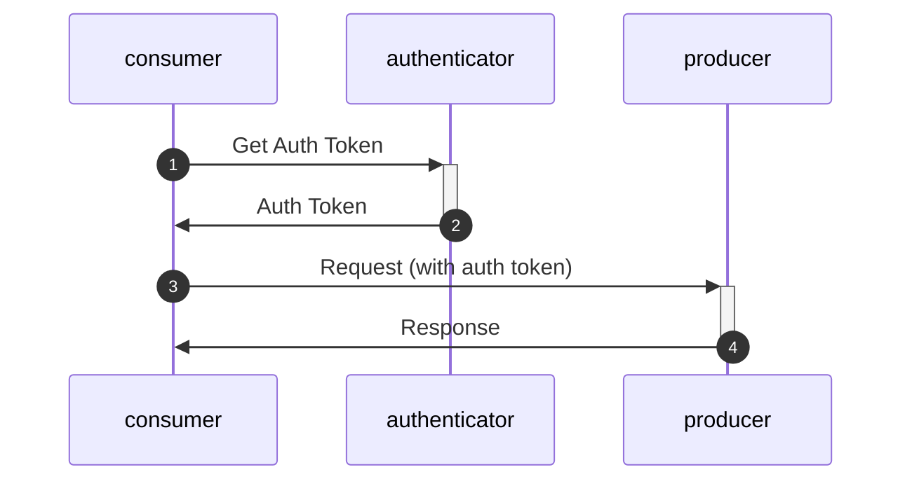

# Authentication en beveiliging

Al het netwerk verkeer word standaard beviligd door minimaal TLS-1.3 encryptie.

Voor authenticatie wordt gebruik gemaakt van oauth2 protocol met client-credentials grant. Dit is een industry standaard (See https://oauth.net/2/) waardoor er standaard ondersteuning is voor veel programmeer talen en frameworks.
Standaarden als nl-gov en edustandaard zijn hier ook op gebaseerd.

Op dit moment worden er geen eisen aan de gebruikte certificaten gesteld anders dan dat ze geldig, herleidbaar naar de leverancier (domainnaam) en een geldig en controleerbaar root-certificaat moeten hebben.
Edustandaard werkt aan een REST profiel, waarbij ook TLS 1.3 en client-credential grant de basis zijn. 

## scopes
Each request will need a scope in the auth token. voor OKD zullen deze beginnen met "okd:".
de verschillende flows zullen verschillende catagorie scopes krijgen, waardoor er fijnmazig toestemming geven kan worden op niveau een MORA referentie componenten.

- flow 1,2,3,4: **okd:alldocuments**
- flow 2: **okd:examdocuments**
- flow 3: **okd:bpvdocuments**
- flow 4: **okd:graduationdocuments**
- flow 1,5: **okd:enrollmentderollment**
- flow 6: **okd:destroyednotification**
- flow 7: **okd:studentinfo**

Leveranciers die applicatie maken die meerdere MORA componenten bevatten kunnen tokens aanvragen met meerdere scopes tegelijkertijd.
....
