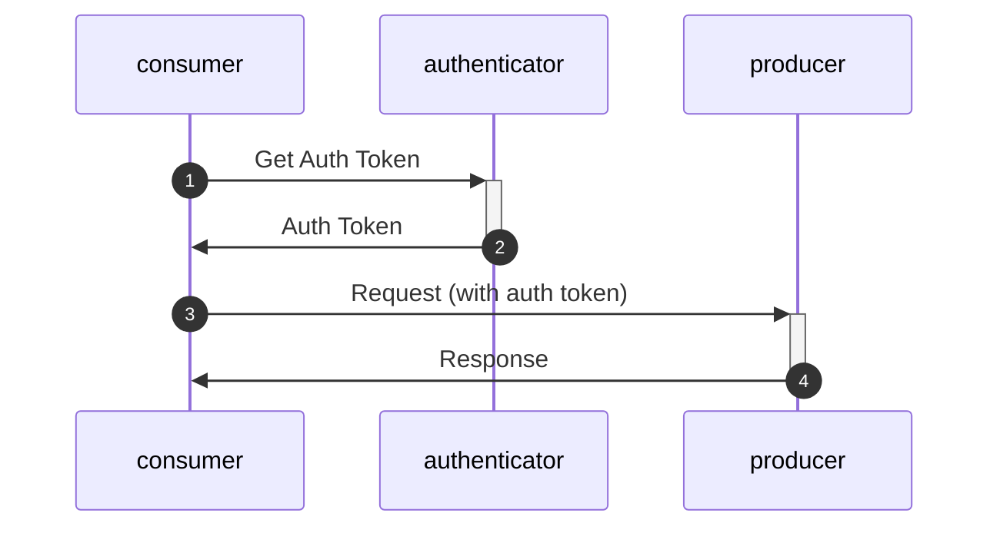

# Authentication en beveiliging

Al het netwerk verkeer word standaard beviligd door minimaal TLS-1.3 encryptie.

Voor authenticatie wordt gebruik gemaakt van oauth2 protocol met client-credentials grant. Dit is een industry standaard (See https://oauth.net/2/) waardoor er standaard ondersteuning is voor veel programmeer talen en frameworks.
Standaarden als nl-gov en edustandaard zijn hier ook op gebaseerd.

Op dit moment worden er geen eisen aan de gebruikte certificaten gesteld anders dan dat ze geldig, herleidbaar naar de leverancier (domainnaam) en een geldig en controleerbaar root-certificaat moeten hebben.
Edustandaard werkt aan een REST profiel, waarbij ook TLS 1.3 en client-credential grant de basis zijn. 



## scopes
Each request will need a scope in the auth token. voor OKD zullen deze beginnen met "okd:".
de verschillende flows zullen verschillende catagorie scopes krijgen, waardoor er fijnmazig toestemming geven kan worden op niveau een MORA referentie componenten.


- flow 1,2,3,4,11,12,13,14: **okd:alldocuments**
- flow 2,12: **okd:examdocuments**
- flow 3,13: **okd:bpvdocuments**
- flow 4,14: **okd:graduationdocuments**
- flow 1,5,11: **okd:enrollmentderollment**
- flow 6: **okd:destroyednotification**
- flow 7: **okd:studentinfo**
- flow 10: geen specifiek
- flow x,y,z: **okd:alldocuments**,**okd:examdocuments**,**okd:bpvdocuments**, **okd:graduationdocuments**

Leveranciers die applicatie maken die meerdere MORA componenten bevatten kunnen tokens aanvragen met meerdere scopes tegelijkertijd.

### Microsoft Azure als identity/token provider
Bij gebruik van Microsoft Azure als identity/token provider is een kleinen incompatibiliteit.
Bij Azure kun je geen scopes aanvragen, je moet altijde de waarde scope=api://{resource-app-id}/.default opgeven en dan krijg je een token met alle scopes warvoor je geautenticeerd bent.

Dit willen we eigenlijk geen onderdeel van de standaard maken, maar wel vragen aan de leveranciers om hier fleibel mee om te gaan als een partij dit nodig heeft. Aanbevolen is om de scopes niet hardcoded te maken of om eerst de scopes normaal te vragen, bij een error van azure de azure default te gebruiken.

Fout die azuer terug levert:
```
{
  "error": "invalid_scope",
  "error_description": "AADSTS1002012: The provided value for scope 'kees' is not valid. 
  Client credential flows must have a scope value with /.default suffixed to the resource identifier."
}
```
....
