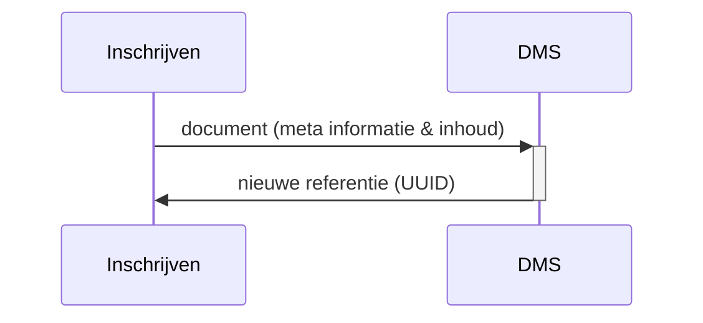

# OKD - Flow 1
Aanbieden van documenten rondom de inschrijving van een student.

## Flow 1.1 Opslaan ondersteunende documenten bij de inschrijving in DMS
Vanuit model Inschrijven naar het DMS: ondersteunende documenten bij de inschrijving die in het student/inschrijvings dossier horen.

### Sequence diagram

### Class diagram 
Todo!!

### Example of request
Todo!!

Info naar het DMS:
- student
- inschrijving en opleiding
- soort document
- meta info over een document (id, size en location)
- voorgestelde bewaar termijn
- inhoud van het document

### Remarks
- Het DMS retourneert de documentreferentie (bijv UUID), hiermee kan document op een later moment gedownload of ingezien worden.
- Het student inschrijvings dossier wordt aangemaakt bij het sturen van het eerste document als het nog niet bestaat.
- DMS krijgt de inhoud van het document indezelfde call als meta informatie

### domain model
- document id
- persoon id, naam
- verbintenis id en bladnummer
- opleiding
- document type (mimetype)
- document catagory
- voorgestelde bewaartermijn (dagen)
- 
