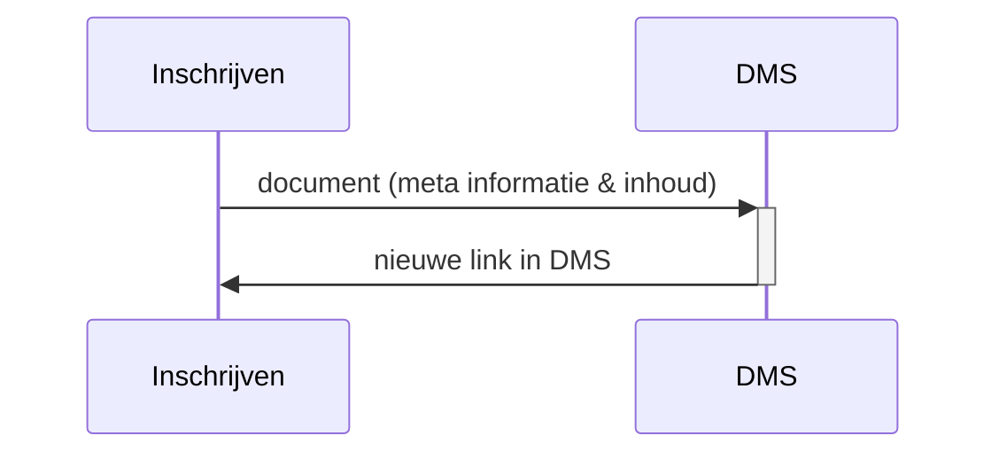

# OKD - Flow 1
Aanbieden van documenten rondom de inschrijving van een student.

vanuit model inschrijven naar het DMS: ondersteunende documenten bij de inschrijving die in het student/inschrijvings dossier horen

info naar het DMS
- student
- inschrijving en opleiding
- soort document
- meta info over een document (id, size en location)
- voorgestelde bewaar termijn
- inhoud van het document

het DMS reageerd met een de link waar het document te bekijken is in het DMS.

Het student inschrijvings dossier wordt aangemaakt bij het sturen van het eerste document als het nog niet bestaat.

optie 1:
DMS krijgt de inhoud van het document indezelfde call als meta informatie

### domain model
- document id
- persoon id, naam
- verbintenis id en bladnummer
- opleiding
- document type (mimetype)
- document catagory
- voorgestelde bewaartermijn (dagen)
- 
