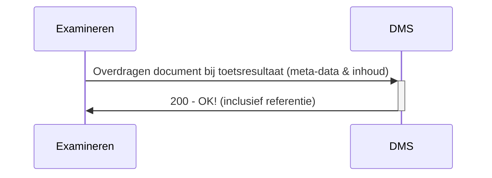
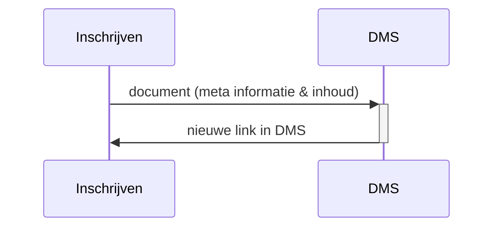

# OKD - Flow 2 - Document overdragen naar DMS
Aanbieden van examenresultaat en examenmoment gerelateerde documenten naar het DMS. Deze documenten worden opgeslagen in DMS als onderdeel van examendossier. 

## Flow 2.1 Document bij toetsresultaat overdragen naar DMS
### Sequence diagram


Remark:
De volgende informatie wordt aangeboden richting  DMS
- student
- opleiding (of verbintenis)
- soort document (bijvoorbeeld toetsresultaat, bijlage bij toetsresultaat, etc.)
- toetsmoment
- toets
- meta info over een document (id, size en location)
- inhoud van het document

### Class diagram van document bij toetsresultaat overdragen naar DMS
todo

### Example of request
```json
PUT /documents/{associationId}
```
todo

Remarks:
- todo


## Flow 2.2 Document bij toetsmoment overdragen naar DMS
Todo! Identiek aan toetsresultaat bijlagen, maar excl. student.


  


info naar het DMS
- student
- inschrijving en opleiding
- soort document
- meta info over een document (id, size en location)
- voorgestelde bewaar termijn
- inhoud van het document

het DMS reageerd met een de link waar het document te bekijken is in het DMS.

Het student inschrijvings dossier wordt aangemaakt bij het sturen van het eerste document als het nog niet bestaat.

DMS krijgt de inhoud van het document indezelfde call als meta informatie

## Flow 1.1 Document overdragen vanuit Inschrijving aan DMS
### Sequence diagram


### Class diagram 


### domain model
- document id
- persoon id, naam
- verbintenis id en bladnummer
- opleiding
- document type (mimetype)
- document catagory
- voorgestelde bewaartermijn (dagen)
- 

