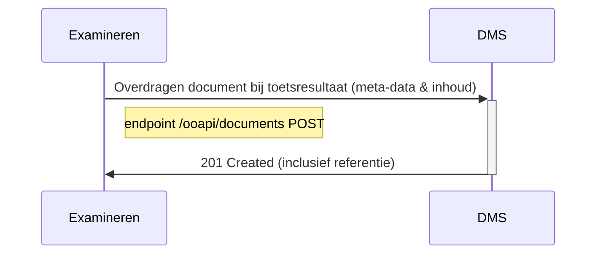

# OKD - Flow 2 - Document overdragen naar DMS
Aanbieden van examenresultaat en examenmoment gerelateerde documenten naar het DMS. Deze documenten worden opgeslagen in DMS als onderdeel van examendossier. 

## Flow 2.1 Document bij toetsresultaat opslaan in DMS
### Sequence diagram


Te bespreken
* V6 beschikt alleen over een GET documents, OKD zal minimaal een POST nodig hebben.
* Waarom wordt in OKE soms "OOAPI" als prefix in endpoint gezet?
* 


Remark:
De volgende informatie wordt aangeboden richting DMS
- inhoud van het document
- document.bronorganisatie
- document.creatiedatum
- document.titel
- document.auteur
- document.taal
- document.type
- student
- afnamemoment toets
- toetsgegevens
- opleiding/verbintenis


### Class diagram van document bij toetsresultaat  opslaan in DMS
todo

### Example of request
```json
POST /documents
```
todo

Remarks:
- todo


## Flow 2.2 Document bij toetsmoment overdragen naar DMS
Todo! Identiek aan toetsresultaat bijlagen, maar excl. student.


## Flow 2.4 Update a document in the DMS
Todo: openmen in 2.1 of apart beschrijven?
