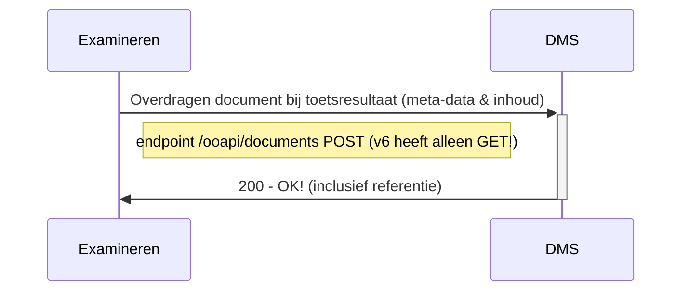
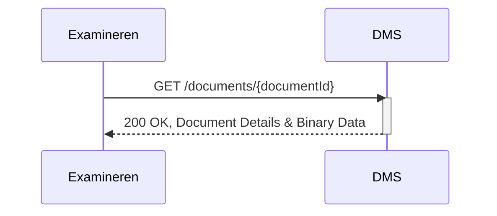

# OKD - Flow 2 - Document overdragen naar DMS
Aanbieden van examenresultaat en examenmoment gerelateerde documenten naar het DMS. Deze documenten worden opgeslagen in DMS als onderdeel van examendossier. 

## Flow 2.1 Document bij toetsresultaat overdragen naar DMS
### Sequence diagram


Remark:
De volgende informatie wordt aangeboden richting DMS
- inhoud van het document
- document.bronorganisatie
- document.creatiedatum
- document.titel
- document.auteur
- document.taal
- document.type
- student
- afnamemoment toets
- toetsgegevens
- opleiding/verbintenis


### Class diagram van document bij toetsresultaat overdragen naar DMS
todo

### Example of request
```json
POST /documents
```
todo

Remarks:
- todo


## Flow 2.2 Document bij toetsmoment overdragen naar DMS
Todo! Identiek aan toetsresultaat bijlagen, maar excl. student.


## Flow 2.3 Reading a document from the DMS
In alignment with the OOAPI and OKE standards, the "examineren" component may need to retrieve specific documents from the Document Management System (DMS). This operation is akin to requesting a single information object, typically used for referencing or verifying exam-related documents. To facilitate this process, the following endpoint is employed:

### Endpoint

- **`GET /documents/{documentId}`**
  - **Description**: Fetches the specified document's details and binary content from the DMS, identified by its `documentId`.
  - **Parameters**: 
    - `documentId` (required): A unique identifier (UUID) for the document to be retrieved.
  - **Response**:
    - **Success 200 (OK)**: Returns the complete document, including metadata and binary data.
    - **Authorization**: While the current version operates without explicit authorization, future updates may include secure access protocols to align with broader OOAPI and OKE security practices.

### Sequence Diagram



Remarks
- todo

## Flow 2.4 Update a document in the DMS
Todo: openmen in 2.1 of apart beschrijven?
