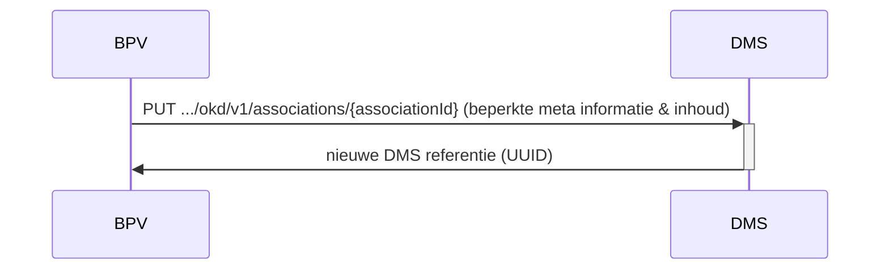

# OKD - Flow 3 - BPV Document overdragen naar DMS
Aanbieden van BPV gerelateerde documenten naar het DMS. Deze documenten worden opgeslagen in DMS als onderdeel van het student inschrijvingsdossier.

## NOG TE DOEN:
ZIE ook details van flow 1
Deze flows lijkt erg op flow 1, met het verschil dat de metainformatie in deze flow beperkt is.

* Een inschrijving van student

Dit wordt nog uitgewerkt zodra we de details van flow 1 100% uitgewerkt hebben om consistent te blijven.

### Sequence diagram 

#### Endpoints voor deze flow bij DMS
- `PUT .../okd/v1/associations/{associationId}`

## Verwerking in DMS
Het DMS kan zelf bepalen hoe de documenten opgeslagen en verwerkt worden: of in een apart BPV-dossier of alles onder het student inschrijvingsdossier

## Remarks
- Berichten van maximaal 1 GB ondersteunen. Als we in de toekomst meer dan 1 GB willen ondersteunen, dan moet de metadata en het bestand apart gestuurd worden.

## Authenticatie:
Scope voor toevoegen van BPV gerelateerde documenten: **okd:alldocuments** en **okd:bpvdocuments**.
Als een van deze 2 aanwezig is in het authenticatie token kan de actie uitgevoerd worden.
