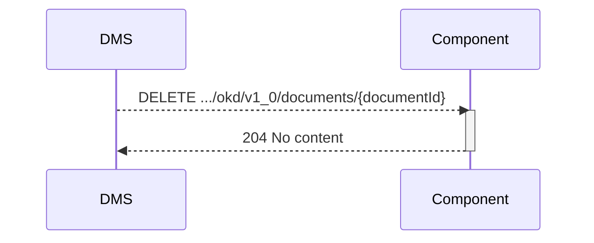

## Flow 6 document vernietigt notificatie

Het DMS besluit dat de bewaartermijn verstreken is en meld bij de componenten dat het document niet langer beschikbaar is.

**Openvraag:** is dit nodig? of merkt de app het wel als er een document getoon moet worden (flow x)

### Endpoint

- **`DELETE .../okd/v1_0/documents/{documentId}`**
  - **Description**: DMS has deleted a specified document, identified by its `documentId`.  Components should remove reference.
  - **Parameters**: 
    - `documentId` (required): A unique identifier (UUID) for the document to be deleted. (OPEN VRAAG : WELK ID? die van DMS of van APP?)
  - **geen body**
  - **Response**:
    - **Success 204 (No content)**

### Sequence Diagram

### Authenticatie:
scope die ook gebruikt is voor notificatie: **okd:destroyednotification**

