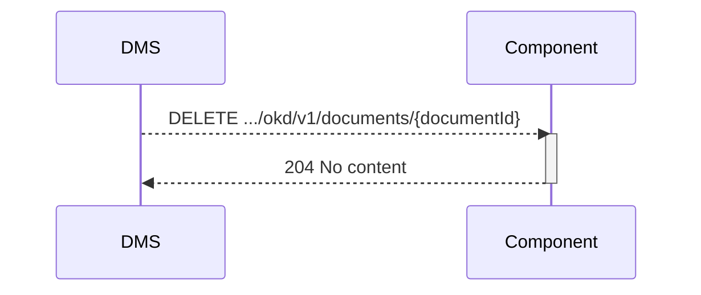

## Flow 6 Document vernietigt notificatie

Nadat de bewaartermijn verstreken is, wordt het document vernietigd in DMS. DMS meldt dat vernietiging heeft plaatsgevonden en dat het document niet langer meer beschikbaar is.

**Openvraag:** Is dit nodig of merkt de app het wel als er een document getoon moet worden (flow x)?
**Openvraag 2:** Komen we niet in conflict met de vraag of de component weet welke documentid gebruikt moet worden? Moeten we hier niet juist het documentid van de component gebruiken?  

### Endpoint

- **`DELETE .../okd/v1/documents/{documentId}`**
  - **Description**: DMS has deleted a specified document, identified by its `documentId`.  Components should remove reference.
  - **Parameters**: 
    - `documentId` (required): A unique identifier (UUID) for the document to be deleted. Dit is het ID dat het DMS in de POST calls eerder geretourneerd heeft. Dus niet het documentID van de component.
  - **geen body**
  - **Response**:
    - **Success 204 (No content)**

### Sequence Diagram

### Authenticatie:
scope die ook gebruikt is voor notificatie: **okd:destroyednotification**
