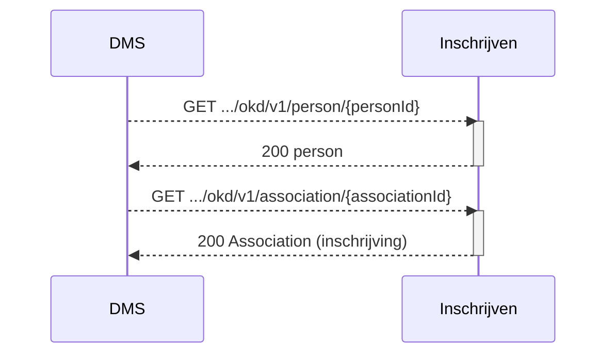

## OKD - Flow 7 Extra student/inschrijving informatie ophalen

Als flow 1 niet geimplementeerd wordt en er bijvoorbeeld alleen documenten via flow 2 en 3 aangeboden worden, heeft het DMS ook een mogelijkheid nodig om student- en inschrijvingsinformatie op te halen.

**Open vraag:** wat is de minimale info die nodig is voor de doelbinding met het DMS? Antwoord: zelfde informatie uit flow 1

### Endpoint

- **`GET .../okd/v1/person/{personId}`**
- **`GET .../okd/v1/association/{associationId}`**

- **`GET .../okd/v1/person?primaryCode={studentNummer}`**

### Sequence Diagram



#### Voorbeeld 1:

GET .../okd/v1/person/5ab399b8-c499-4da8-af6d-b55e66251f31

Response
```
{
    "personId": "5ab399b8-c499-4da8-af6d-b55e66251f31",
    "primaryCode": 
    {
        "codeType": "studentNumber",
        "code": "1234567"
    },
    "givenName": "Maartje",
    "surnamePrefix": "van",
    "surname": "Damme",
    "displayName": "Maartje van Damme",
    "initials": "MCW",
    "activeEnrollment": true,
    "affiliations": 
    [
        "student"
    ],
    "mail": "vandamme.mcw@student.roc.nl",
    "languageOfChoice":	[
        "nl-NL"
    ],
    "otherCodes": []
}
```

#### Voorbeeld 2:

GET .../okd/v1/person?primaryCode=1234567

Response
```
{
"pageSize": 1,
"pageNumber": 1,
"hasPreviousPage": false,
"hasNextPage": false,
"totalPages": 1,
"items": [
  {
      "personId": "5ab399b8-c499-4da8-af6d-b55e66251f31",
      "primaryCode": 
      {
          "codeType": "studentNumber",
          "code": "1234567"
      },
      "givenName": "Maartje",
      "surnamePrefix": "van",
      "surname": "Damme",
      "displayName": "Maartje van Damme",
      "initials": "MCW",
      "activeEnrollment": true,
      "affiliations": 
      [
          "student"
      ],
      "mail": "vandamme.mcw@student.roc.nl",
      "languageOfChoice":	[
          "nl-NL"
      ],
      "otherCodes": []
  }
]
```
Note: Alleen de query parameter 'primaryCode' word ondersteund, tbv conversie en legacy 

#### Voorbeeld 3:

GET .../okd/v1/association/123e4567-e89b-12d3-a456-426614174000

Response
```
{
    "associationId: "123e4567-e89b-12d3-a456-426614174000",
    "associationType": "programOfferingAssociation",
    "role": "student",
    "state": "associated",
    "primaryCode": {
        "codeType": "opleidingsblad",
        "code": "1.1"
    },
    "otherCodes": [
        {
            "codeType": "opleidingscode",
            "code": "23089"
        }
    ],            
    "consumers": [
        {
            "consumerKey": "nl-okd",
            "enrollmentStartDate": "2021-09-01", 
            "enrollmentExpectedEndDate": "2025-07-31",
            "enrollmentFinalEndDate": null
        }
    ]
    "person": {
        "personId": "5ab399b8-c499-4da8-af6d-b55e66251f31",
        "primaryCode": 
        {
            "codeType": "studentNumber",
            "code": "1234567"
        },
        "givenName": "Maartje",
        "surnamePrefix": "van",
        "surname": "Damme",
        "displayName": "Maartje van Damme",
        "initials": "MCW",
        "activeEnrollment": true,
        "affiliations": 
        [
            "student"
        ],
        "mail": "vandamme.mcw@student.roc.nl",
        "languageOfChoice":	[
            "nl-NL"
        ],
        "otherCodes": []
    },
    "offering": {
        "offeringId": "5ffc6127-debe-48ce-90ae-75ea80756475",
        "primaryCode": {
        "codeType": "identifier",
        "code": "25190BOL"
        },
        "offeringType": "program",
        "name": "Netwerk- en mediabeheerder BOL (25190)",
        "program": {
            "programId": "123e4567-e89b-12d3-a456-426614174000",
            "primaryCode": {
                "codeType": "identifier",
                "code": "C12063128"
            },
            "programType": "program",
            "name": [
                {
                "language": "nl-NL",
                "value": "Netwerk- en mediabeheerder"
                }
            ],
            "abbreviation": "N&M",
            "description": [
                {
                "language": "nl-NL",
                "value": "In deze MBO-opleiding word je opgeleid voor het officieel erkende diploma 'MBO Netwerkbeheerder, niveau 4'. Met dit diploma ben je breed opgeleid en kun je het netwerk van een organisatie beheren. Dit is hét diploma voor de professionele netwerkbeheerder op het hoogste MBO-niveau. Je legt een uitstekende basis voor een mooie carrière als netwerkbeheerder. Bovendien is dit een diploma waarmee je eventueel probleemloos kunt doorstuderen naar een HBO-opleiding"
                }
            ],
            "teachingLanguage": "nld",
            "modeOfStudy": "full-time",
            "levelOfQualification": "4"
        },
        "organization": {
            "organizationID": "38bdbeb1-12b2-48fd-84f8-653e7adfaf99",
            "primaryCode": {
                "codeType": "identifier",
                "code": "ICTE"
            },
            "organizationType": "department",
            "name": [
                {
                "language": "nl-NL",
                "value": "ICT-academie"
                }
            ],
            "shortname": "ICTA",
            "parent": {
                "organizationID": "650e1627-9f3d-4176-ab5a-e82eef0d219d",
                "primaryCode": {
                "codeType": "identifier",
                "code": "CICT"
                },
                "name": [
                {
                    "language": "nl-NL",
                    "value": "Cluster ICT en EIS"
                }
                ]
            }
        }
    }
```


### OKD consumer
Het ooapi uitbreidingsmechanisme van consumers word gebruikt voor extra informatie:
* "consumerKey": dit moet hardcoded "nl-okd" zijn ter identificatie van de consumer,

Specifiek voor inschrijven : 3 datums voor de inschrijving van deze student:
* "enrollmentStartDate": "2021-09-01", 
* "enrollmentExpectedEndDate": "2025-07-31",
* "enrollmentFinalEndDate": null

### Authenticatie:
scope: **okd:studentinfo**


