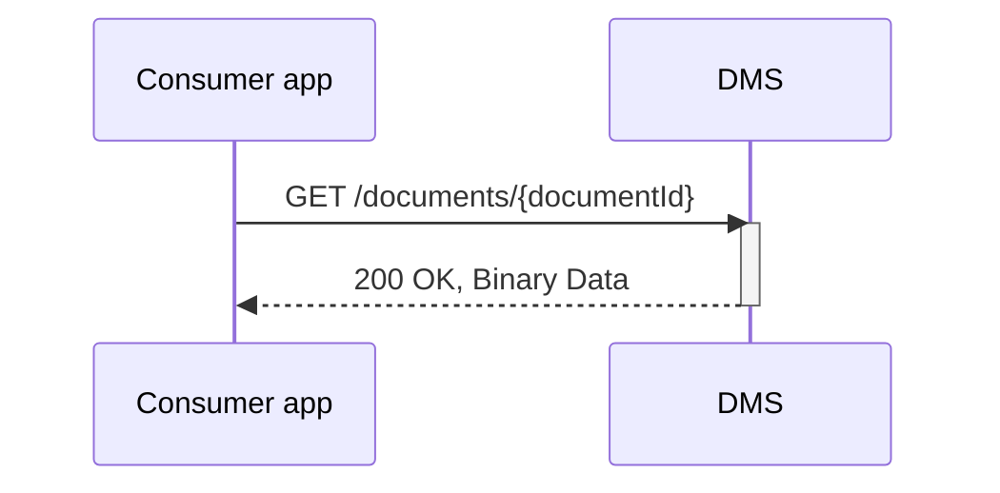

## Flow x Opvragen document
todo

### Endpoint

- **`GET /documents/{documentId}`**
  - **Description**: Fetches the specified document's  binary content from the DMS, identified by its `documentId`.
  - **Parameters**: 
    - `documentId` (required): A unique identifier (UUID) for the document to be retrieved.
  - **Response**:
    - **Success 200 (OK)**: Returns the complete document binary data.

### Sequence Diagram

Bespreekpunten
- Openen van document eigenschappen scherm is niet mogelijk, kan alleen via een URL naar de zaak. Echter, dat kan uitsluitend vanuit zaak API, oftewel consumer app zou kennis van zaken moeten hebben. Nut- noodzaak van deze behoefte heroverwegen i.r.t. V1

