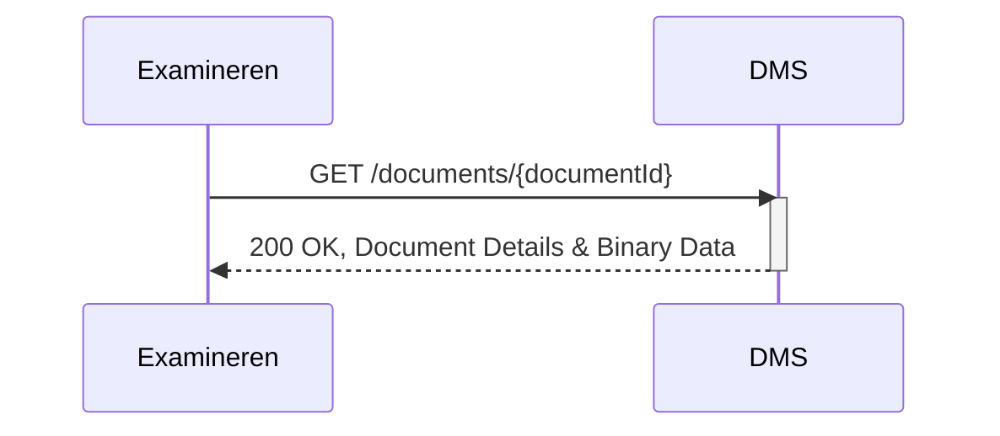

## Flow x Opvragen document
todo

### Endpoint

- **`GET /documents/{documentId}`**
  - **Description**: Fetches the specified document's details and binary content from the DMS, identified by its `documentId`.
  - **Parameters**: 
    - `documentId` (required): A unique identifier (UUID) for the document to be retrieved.
  - **Response**:
    - **Success 200 (OK)**: Returns the complete document, including metadata and binary data.
    - **Authorization**: While the current version operates without explicit authorization, future updates may include secure access protocols to align with broader OOAPI and OKE security practices.

### Sequence Diagram

Remarks
- todo
