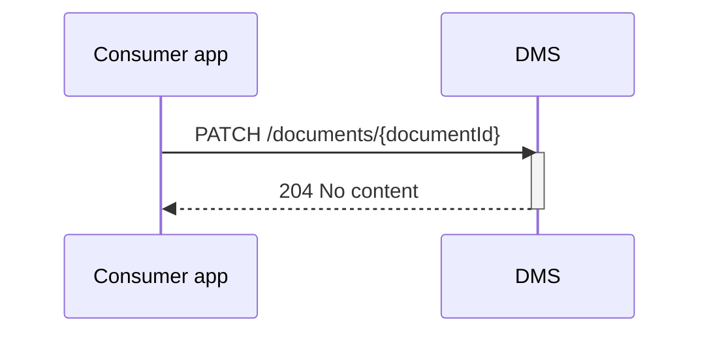

## Flow y Updaten document
Updaten van een document.
TODO: wat is een update: nieuwe versie of de inhoud veranderen zopnder dat de meta data verandert?
Mag dat altijd?

### Endpoint

### optie 1
*  endpoint /ooapi/documents/{documentid}/_lock POST
*  endpoint /ooapi/documents/{documentid} PATCH
*  endpoint /ooapi/documents/{documentid}/_unlock POST 

of
 *  endpoint /ooapi/documents/{documentid}/_lock DELETE 

### optie 2
direct de nieuwe inhoud van het document uploaden. Als het document gelocked is faalt de call
*  endpoint /ooapi/documents/{documentid} PATCH

### Sequence Diagram

