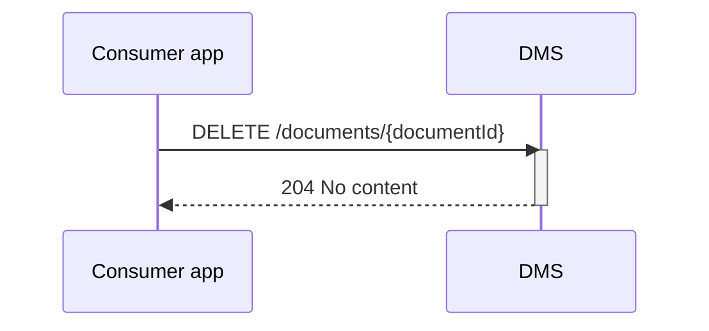

## Flow z Verwijderen van een document
Als er in een van de apps bewust besloten word om een document te verwijderen, dan is een cal naar het docuemnt endpoint van het DMS de manier om het DMS te informeren. Wat het DMS er dan mee doet is applicatie afhankelijk. 
* weggooien
* verbergen
* markeren

is allemaal goed voor de OKD.

### Endpoint

- **`DELETE /documents/{documentId}`**
  - **Description**: Delete a specified document from the DMS, identified by its `documentId`. 
  - **Parameters**: 
    - `documentId` (required): A unique identifier (UUID) for the document to be deleted. (OPEN VRAAG : WELK ID? die van DMS of van APP?)
  - **geen body**
  - **Response**:
    - **Success 204 (No content)**

### Sequence Diagram

### Authenticatie:
scope die ook gebruikt is voor toevoegen (nader invullen)

### Bespreekpunten
- Is de response code 204 prima en in lijn? Ja.
