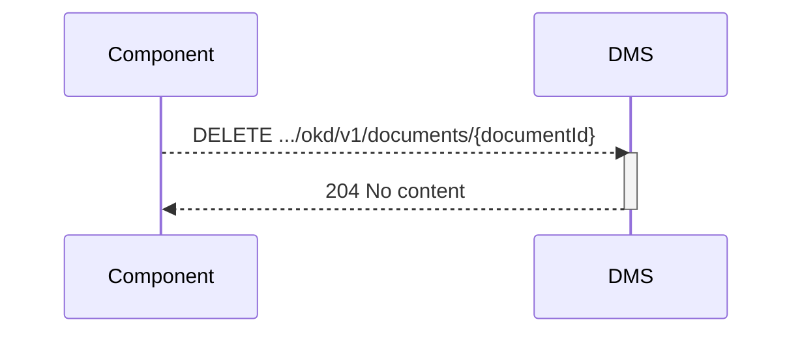

## Flow z Verwijderen van een document

De app besluit dat het document bewust verwijderd wordt. (privacy, error correctie, etc)

Als er in een van de apps bewust besloten word om een document te verwijderen, dan is een call naar het document endpoint van het DMS de manier om het DMS te informeren. Wat het DMS er dan mee doet is applicatie afhankelijk. 
* weggooien
* verbergen
* markeren 

is allemaal goed voor de OKD.

**Openvraag:** kan een dms dit verwerken? zijn er uitzonderingen?

### Endpoint

- **`DELETE .../okd/v1/documents/{documentId}`**
  - **Description**: Delete a specified document from the DMS, identified by its `documentId`. 
  - **Parameters**: 
    - `documentId` (required): A unique identifier (UUID) for the document to be deleted. (OPEN VRAAG : WELK ID? die van DMS of van APP?)
  - **geen body**
  - **Response**:
    - **Success 204 (No content)**

### Sequence Diagram

### Authenticatie:
scope die ook gebruikt is voor verwijderen is zelfde als voor toevoegen. (**okd:alldocuments** of de specifiekere varianten)

