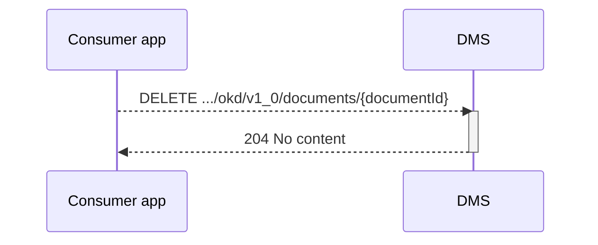
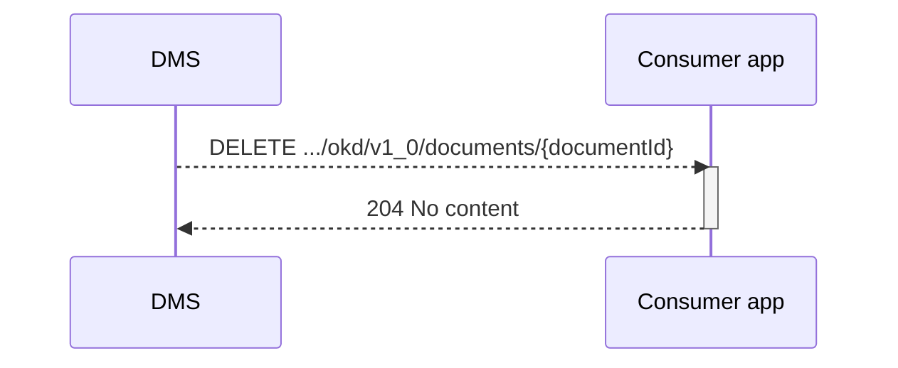

## Flow z Verwijderen van een document

2 scenario's:
* De app besluit dat het document beust verwijdert word
* het DMS besluit dat de bewaartermijn verstreken is en meld bij d eapp dat het document niet langer beschikbaar is.

### scenario 1:
Als er in een van de apps bewust besloten word om een document te verwijderen, dan is een cal naar het docuemnt endpoint van het DMS de manier om het DMS te informeren. Wat het DMS er dan mee doet is applicatie afhankelijk. 
* weggooien
* verbergen
* markeren
is allemaal goed voor de OKD.

### scenario 2:
Als het DMS een document verwijdert word een seintje gegeven naar de app dat het document weg is.

**Openvraag:** is dit nodig? of merkt de app het wel als er een document getoon moet worden (flow x)

### Endpoint
voor beide scenario's is de zelfde call gedefinieerd. alleen is in het 2e scenarion de DMS de initiator

- **`DELETE .../okd/v1_0/documents/{documentId}`**
  - **Description**: Delete a specified document from the DMS, identified by its `documentId`. 
  - **Parameters**: 
    - `documentId` (required): A unique identifier (UUID) for the document to be deleted. (OPEN VRAAG : WELK ID? die van DMS of van APP?)
  - **geen body**
  - **Response**:
    - **Success 204 (No content)**

### Sequence Diagram

en 

### Authenticatie:
scope die ook gebruikt is voor toevoegen (nader invullen)

### Bespreekpunten
- Is de response code 204 prima en in lijn? Ja.
