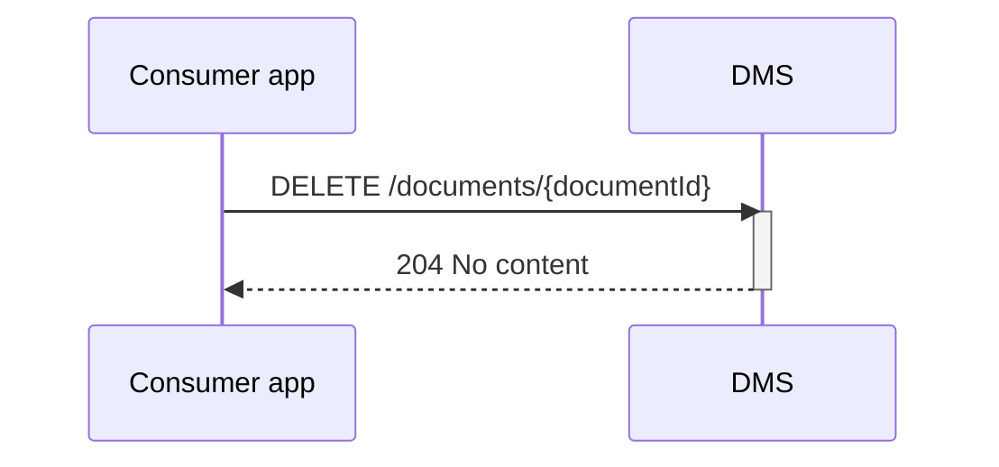

## Flow z Verwijderen van een document
todo

### Endpoint

- **`DELETE /documents/{documentId}`**
  - **Description**: Delete a specified document from the DMS, identified by its `documentId`.
  - **Parameters**: 
    - `documentId` (required): A unique identifier (UUID) for the document to be retrieved.
  - **Response**:
    - **Success 204 (No content)**

### Sequence Diagram

Bespreekpunten
- Is de response code 204 prima en in lijn? Daarbij is het gebruikelijk om geen response terug te geven.
